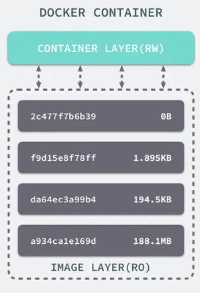
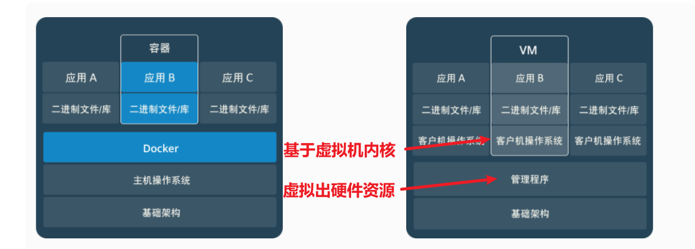

# Docker基本概念

### 镜像(Image):一个特殊的文件系统

##### 什么是镜像

Docker 镜像是一个**特殊的文件系统**，除了**提供容器运行时所需的程序、库、资源、配置等文件**外，还包含了一些为运行时准备的**一些配置参数**（如匿名卷、环境变量、用户等）。镜像**不包含任何动态数据**，其内容在构建之后也不会被改变。

操作系统分为内核和用户空间。对于 Linux 而言，内核启动后，会挂载 root 文件系统为其提供用户空间支持。而 Docker 镜像（Image），就相当于是一个 root 文件系统。

Docker 设计时，就充分利用 **Union FS** 的技术，将其设计为**分层存储的架构** 。镜像实际是由多层文件系统联合组成。**镜像构建时，会一层层构建，前一层是后一层的基础。每一层构建完就不会再发生改变，后一层上的任何改变只发生在自己这一层。** 比如，删除前一层文件的操作，实际不是真的删除前一层的文件，而是仅在当前层标记为该文件已删除。在最终容器运行的时候，虽然不会看到这个文件，但是实际上该文件会一直跟随镜像。因此，在构建镜像的时候，需要额外小心，每一层尽量只包含该层需要添加的东西，任何额外的东西应该在该层构建结束前清理掉。

分层存储的特征还使得镜像的复用、定制变的更为容易。甚至可以用之前构建好的镜像作为基础层，然后进一步添加新的层，以定制自己所需的内容，构建新的镜像。

##### Union FS 构建镜像的原理

###### UnionFS 定义

联合文件系统（UnionFS）是一种分层、轻量级并且高性能的文件系统，它支持对文件系统的修改作为一次提交来一层层的叠加，同时可以将不同目录挂载到同一个虚拟文件系统下(unite several directories into a single virtual filesystem)。

Docker镜像的设计中，引入了层（layer）的概念，也就是说，用户制作镜像的每一步操作，都会生成一个层，也就是一个增量rootfs（一个目录），这样应用A和应用B所在的容器共同引用相同的Debian操作系统层或是Unbuntu系统层等、Golang环境层（作为只读层），而各自有各自应用程序层和可写层。启动容器的时候通过UnionFS把相关的层挂载到一个目录，作为容器的根文件系统。

rootfs只是一个操作系统所包含的文件、配置和目录，并**不包括操作系统内核**。这就意味着，如果你的应用程序需要配置内核参数、加载额外的内核模块，以及跟内核进行直接的交互，你就需要注意了：这些操作和依赖的对象，都是宿主机操作系统的内核，它对于该机器上的所有容器来说是一个“全局变量”，牵一发而动全身。

###### UnionFS 原理

- Union FS 采用联合挂载的方式,将多个不同的文件系统层叠组合成一个虚拟的统一文件系统。这些层可以是只读的基础层,也可以是可写的上层。读写操作会在这些层之间进行适当的分发和合并。
- 写时复制(Copy-on-Write):
  - 当进行写操作时,Union FS 不会立即修改底层的只读文件系统。
  - 相反,它会在上层创建一个新的可写副本,将写入的数据保存在这个新的可写层中。
- 层次结构:
  - Union FS 将文件系统组织成一个层次结构,每一层都是一个独立的文件系统（基于文件系统的中心化存储模型，而git使用的是基于内容寻址的分散式存储模型）。
  - 上层文件系统会遮挡下层同名文件,形成一个统一的视图。
- 增量存储:
  - Union FS 采用增量存储的方式,只记录文件系统的差异变更,而不是完整的文件内容（这里和git不一样，git的记录颗粒度更细致，他记录每一个文件）。
  - 这样可以大幅减少存储空间的开销,提高文件系统的效率。
- 版本管理:
  - Union FS 可以**记录每一层文件系统的快照**，形成一个完整的版本历史（不提供版本的回溯等功能，和git不一样）。
  - 这样可以实现文件系统的回滚和版本比较等功能。

###### 构建过程

```
FROM ubuntu:15.04

COPY . /app

RUN make /app

CMD python /app/app.py
```

容器中的每一层都只对当前容器进行了非常小的修改，上述的 Dockerfile 文件会构建一个拥有四层 layer 的镜像：



### 容器(Container):镜像运行时的实体

镜像（Image）和容器（Container）的关系，就像是面向对象程序设计中的 类 和 实例 一样，镜像是静态的定义，**容器是镜像运行时的实体。容器可以被创建、启动、停止、删除、暂停等** 。

**容器的实质是进程，但与直接在宿主执行的进程不同，容器进程运行于属于自己的独立的 命名空间。前面讲过镜像使用的是分层存储，容器也是如此。**

**容器存储层的生存周期和容器一样，容器消亡时，容器存储层也随之消亡。因此，任何保存于容器存储层的信息都会随容器删除而丢失。**

按照 Docker 最佳实践的要求，**容器不应该向其存储层内写入任何数据** ，容器存储层要保持无状态化。**所有的文件写入操作，都应该使用数据卷（Volume）、或者绑定宿主目录**，在这些位置的读写会跳过容器存储层，直接对宿主(或网络存储)发生读写，其性能和稳定性更高。数据卷的生存周期独立于容器，容器消亡，数据卷不会消亡。因此， **使用数据卷后，容器可以随意删除、重新 run ，数据却不会丢失。

##### 镜像存储和构建共享

Docker 镜像是由多个层级构成的,每一层都是一个文件系统。当构建一个新的镜像时,Docker 会检查基础层是否已经存在,如果存在则会直接重用,而不需要重新下载或构建。这样可以大大提高构建效率,节省存储空间。如果 imageA 和 imageB 共享相同的基础层,那么这些共享的层就不需要重复存储,从而减少了镜像的总体体积。这是 Docker 镜像分层设计的一个重要优势。

##### 容器运行后都有自己镜像副本

容器启动时,Docker 会将整个镜像层次结构加载到容器的内存中。这里即使多个容器使用了同一个镜像,每个容器也会有自己独立的镜像层拷贝。彼此是隔离的。也就是说,容器之间不会共享内存中的镜像层，除非使用卷挂载等特殊机制。

### 仓库(Repository):集中存放镜像文件的地方

镜像构建完成后，可以很容易的在当前宿主上运行，但是， **如果需要在其它服务器上使用这个镜像，我们就需要一个集中的存储、分发镜像的服务，Docker Registry 就是这样的服务。**

一个 Docker Registry 中可以包含多个仓库（Repository）；每个仓库可以包含多个标签（Tag）；每个标签对应一个镜像。所以说：**镜像仓库是 Docker 用来集中存放镜像文件的地方类似于我们之前常用的代码仓库。**

# Docker原理和优势

### 原理（namespace 和 CGroup ）

首先，Docker 是基于轻量级虚拟化技术的软件。

简单点来说，虚拟化技术可以这样定义：

> 虚拟化技术是一种资源管理技术，是将计算机的各种实体资源 cpu、内存、磁盘空间、网络适配器等，予以抽象、转换后呈现出来并可供分割、组合为一个或多个电脑配置环境。由此，打破实体结构间的不可切割的障碍，使用户可以比原本的配置更好的方式来应用这些电脑硬件资源。这些资源的新虚拟部分是不受现有资源的架设方式，地域或物理配置所限制。一般所指的虚拟化资源包括计算能力和数据存储。

------

Docker 技术是基于 LXC（Linux container- Linux 容器）虚拟容器技术的。主要是借助 Linux 内核中提供的 CGroup 功能和 namespace 来实现的，通过 LXC 可以为软件提供一个独立的操作系统运行环境。

- namespace 是 Linux 内核用来**隔离内核资源**的方式。通过 namespace 可以让一些进程只能看到与自己相关的一部分资源，而另外一些进程也只能看到与它们自己相关的资源，这两拨进程根本就感觉不到对方的存在。具体的实现方式是把一个或多个进程的相关资源指定在同一个 namespace 中。Linux namespaces 是对全局系统资源的一种封装隔离，使得处于不同 namespace 的进程拥有独立的全局系统资源，改变一个 namespace 中的系统资源只会影响当前 namespace 里的进程，对其他 namespace 中的进程没有影响。
- CGroup 是 **Control** Groups 的缩写，是 Linux 内核提供的一种可以限制、记录、隔离进程组 (process groups) 所使用的物理资源 (如 cpu memory i/o 等等) 的机制。

两者都是将进程进行分组，但是两者的作用还是有本质区别。**namespace 是为了隔离进程组之间的资源，而 cgroup 是为了对一组进程进行统一的资源监控和限制。**

### docker对比虚拟机（更加轻量级，线程级的虚拟）

**容器和虚拟机具有相似的资源隔离和分配优势，但功能有所不同，因为容器虚拟化的是操作系统，而不是硬件，因此容器更容易移植，效率也更高。**

容器是一个应用层抽象，用于将代码和依赖资源打包在一起。 多个容器可以在同一台机器上运行，**共享操作系统内核**，但各自作为独立的进程在用户空间中运行 。与虚拟机相比， 容器占用的空间较少（容器镜像大小通常只有几十兆），**瞬间就能完成启动** （因为就像新开了一个大的线程）。

虚拟机 (VM) **抽象出物理硬件**，在其上**搭建系统**，需要加载自己的内核。管理程序允许多个 VM 在一台机器上运行。每个 VM 都包含一整套操作系统、一个或多个应用、必要的二进制文件和库资源，因此 占用大量空间 。而且 VM **启动也十分缓慢** （需要加载、启动自己内核）。

传统虚拟机技术是虚拟出一套硬件后，在其上运行一个完整操作系统，在该系统上再运行所需应用进程；而容器内的应用进程直接运行于宿主的内核，容器内没有自己的内核，而且也没有进行硬件虚拟。因此容器要比传统虚拟机更为轻便。




### 为什么要用 Docker ?

- 一致的运行环境：Docker 的镜像提供了除内核外完整的运行时环境，确保了应用运行环境一致性，从而不会再出现 “这段代码在我机器上没问题啊” 这类问题；
- 快速的启动时间：可以做到秒级、甚至毫秒级的启动时间。大大的节约了开发、测试、部署的时间。
- 隔离性：避免公用的服务器，资源会容易受到其他用户的影响。
- 快速扩展：善于处理集中爆发的服务器使用压力；
- 方便迁移：可以很轻易的将在一个平台上运行的应用，迁移到另一个平台上，而不用担心运行环境的变化导致应用无法正常运行的情况。
- 持续交付和部署：使用 Docker 可以通过定制应用镜像来实现持续集成、持续交付、部署。

# Docker常见命令

### 基本命令

```
docker version # 查看docker版本
docker images # 查看所有已下载镜像，等价于：docker image ls 命令
docker container ls # 查看所有容器
docker ps #查看正在运行的容器
docker image prune # 清理临时的、没有被使用的镜像文件。-a, --all: 删除所有没有用的镜像，而不仅仅是临时文件；
```

### 拉取镜像

```
docker search mysql # 查看mysql相关镜像
docker pull mysql:5.7 # 拉取mysql镜像
docker image ls # 查看所有已下载镜像
```

### 构建镜像

```
#
# imageName 是镜像名称，1.0.0 是镜像的版本号或标签
docker build -t imageName:1.0.0 .
```

`Dockerfile` 内容可能如下（也就是基于父镜像增量构建image的过程）：

```
# 使用官方 Python 运行时作为父镜像
FROM python:3.8-slim

# 设置工作目录
WORKDIR /app

# 将当前目录下的内容复制到容器的工作目录
COPY . .

# 安装依赖
RUN pip install --no-cache-dir -r requirements.txt

# 设置环境变量
ENV FLASK_APP=app.py
ENV FLASK_ENV=development

# 暴露端口
EXPOSE 5000

# 默认命令
CMD ["flask", "run", "--host=0.0.0.0"]
```

### 删除镜像

比如我们要删除我们下载的 mysql 镜像。

通过 `docker rmi [image]` （等价于`docker image rm [image]`）删除镜像之前首先要确保这个镜像没有被容器引用（可以通过标签名称或者镜像 ID 删除）。通过我们前面讲的`docker ps`命令即可查看。暂停或者关闭后删除。

```
docker rmi f6509bac4980 #  或者 docker rmi mysql
```

# Docker数据管理

主要用于宿主机和容器进行数据交互，常用于构建数据库镜像进行本地持久化、服务需要挂在自己的conf配置文件

### 两种方式

1. 数据卷（Volumes）

   ```
   # 创建一个数据卷
   docker volume create my-vol
   # 查看所有的数据卷
   docker volume ls
   # 查看数据卷的具体信息
   docker inspect web
   # 删除指定的数据卷
   docker volume rm my-vol
   ```

2. 直接用绝对路径挂载主机目录 (Bind mounts)

`--mount` 选项可以接受 `type` 参数，以区分卷类型，例如：

- `type=volume` 表示Docker卷。
- `type=bind` 表示主机目录的绑定挂载。

`--mount` 选项在 `docker run` 命令中用于挂载卷（volume）或绑定挂载（bind mount）到容器中。这个选项允许你在容器的文件系统中创建一个持久化的或与主机共享的目录。

### demo

比如`--mount source=my-vol,target=/usr/share/nginx/html` 这个具体的选项做了以下几件事：

1. **source=my-vol**：指定了数据源，即要挂载的卷的名称。在这里，`my-vol` 是一个已经存在或即将创建的Docker卷的名称。
2. **target=/usr/share/nginx/html**：指定了容器内部的目标挂载点。在这个例子中，`/usr/share/nginx/html` 是Nginx容器内部的HTML文档根目录，挂载后，任何存储在卷 `my-vol` 上的数据都会在容器内部以 `/usr/share/nginx/html` 目录的形式出现。

当容器运行时，`--mount` 选项创建了一个从卷到容器内部指定目录的链接。这意味着：

- 任何写入 `/usr/share/nginx/html` 目录的数据都会被保存在卷 `my-vol` 上，即使容器停止或重启，数据仍然保留。
- 卷上的数据可以在不同容器之间共享，只要这些容器都挂载了同一个卷。
- 如果卷上已经有数据，这些数据将在容器启动时立即可用，无需再次复制或传输。

卷的主要优点是它们提供了更好的数据持久性和隔离性，与容器的生命周期无关，而且在容器间共享数据时更为高效和安全。

默认情况下，如果不指定 `type`，则会根据 `source` 的值自动判断类型。如果 `source` 是一个卷的名称，则类型为 `volume`；如果 `source` 是一个主机上的绝对路径，则类型为 `bind`。

# Docker Compose

Docker Compose 是 Docker 官方编排（Orchestration）项目之一，基于 Python 编写，负责实现对 Docker 容器集群的快速编排。通过 Docker Compose，开发者可以使用 YAML 文件来配置应用的所有服务，然后只需一个简单的命令即可创建和启动所有服务。

Docker Compose 是开源项目，地址：[https://github.com/docker/composeopen in new window](https://github.com/docker/compose)。

Docker Compose 的核心功能：

- **多容器管理**：允许用户在一个 YAML 文件中定义和管理多个容器。
- **服务编排**：配置容器间的网络和依赖关系。
- **一键部署**：通过简单的命令，如`docker-compose up`和`docker-compose down`，可以轻松地启动和停止整个应用程序。

Docker Compose 简化了多容器应用程序的开发、测试和部署过程，提高了开发团队的生产力，同时降低了应用程序的部署复杂度和管理成本。

